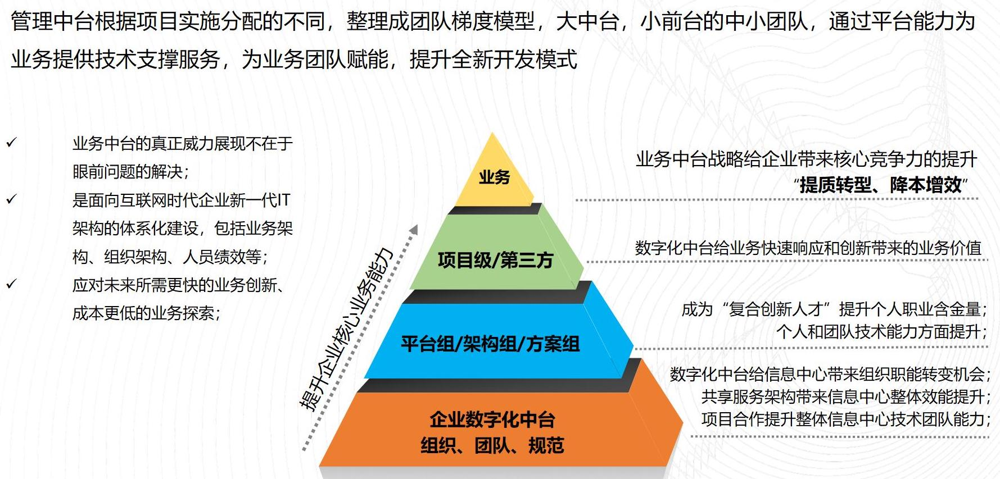

# ACP数字中台

> 本基线主要为了学习交流学习使用，部分图片为网上获取，如有侵权，请说明

## 建设愿景

在转型中台架构，看到的资料和成体系的都比较少，包括整体的落地思路和文档等，都相对比较少，自己一边学习一边实践一边总结，希望可以得出一套中台。

这里规划了从政策、行业、战略、团队、架构、产品、技术、项目、业务、开发等一整体的内容，涵盖技术点前端、后台、容器、自动化、大数据、运维监控等，维护一套就可以。

明确说明，当前此非为全部开源，自己需要梳理，团队暂时处理维护不了那么多开源项目，后期稳定之后再考虑看看处理方案。

### 项目愿景

协助中小企业快速平台化、中台化、数字化，中小微团队转型的最佳平台 

### 个人愿景

> 需要的是一个平台，在这个平台上面，不断沉淀自己，毕竟每天都在学习东西，接触新的技术点

- 有方向感，不迷茫，不浪费时间，有可行的学习计划
- 在工作和学习过得中不断积累和提高学习效率
- 可以总结和反思，过程可以不断的打磨出一个平台，一个产品或者一个精品
- 扩大自己的视野和学习心态，开放心态

<a href="https://zhuanlan.zhihu.com/p/70488590">开发为什么要从零开始搭建属于自己的统一研发平台和中台架构</a>

## 项目概述

ACP数字中台，用于数字化平台中台的搭建学习交流群，用于分享和解决企业数字化的建设和搭建教程，基于中台架构，构建技术/业务/组织/数据中台，更好的支撑企业数字化转型建设，进一步提升企业数字化转型。

当前软件人才的建立，不能仅仅是照着以前的建设思路进行的梳理整合，更多的是对资源的整合点，软件项目的开发，人才的培养，更多的是建议在多方面人才的成长，提出新一代的软件开发人才和技能成长要求。

## 建设说明

整体建设从 0 到 1 的过程，包括数字化涉及到的相关技术，过程问题，组织调整等，进一步的整合学习，为下一步智能化的发展提供提一步的基础准备。

## 建设内容

整体建设通过“1+3+N”的整合思路，进行整体的建设，为企业数字化和智能化打下进一步的基础。

1. 整体企业中台建设规划（1 个平台+3 个中台+N 套业务）
2. 管理组织整体架构建设
3. 基础技术中台架构建设
4. 基础研发组件设计建设
5. 数据治理套件设计建设
6. 业务中台套件建设沉淀（企业解决方案、资产沉淀）

## 数字化中台架构

整体数字化中台架构规划:

基础 DevOps 技术体系

整体数字中台产品架构

<!-- > 此图来自端点科技架构功能，后期更新 -->

组织管理中台架构

## 总体输出内容

进行自我的规划输出，进行能力的输出，业绩的输出，价值体现的输出，技术能力的输出，个人思维的输出等等，
进行一系列的个人输出，这个时候的输出跟自己匹配的，也是需要的。

### 输出规划

- 战略输出
- 技术输出
- 架构输出
- 中台输出
- 方案输出
- 落地输出

### 管理体系

管理是中台稳定落地的基石，阐述管理思路，同时提供部门人员的成长体系，主要包括人员的成长规划、等级规划、培训规划等，提升人员的基本素质，能力，为中台落地提供基石；

同时提供开发流程、测试流程、运维流程、过程监控，过程文档产出等，进一步提高规范管理。

### 技术体系

技术是研发部门核心力量，是团队实力和发展的体现，这里主要是提供先进的技术底座，为上层的研发提供有力工具，集成 devops，与微服务、虚拟化、容器的整合。

过程的高度自动化，小组间高效协作和自动化工具实现基于软件的业务持续创新，支持高效交付，缩短软件开发迭代周期，快速获取反馈，提升软件质量及稳定性.

能提升 IT 部门的单位生产率、降低哪些重复工作的成本、降低人工误操作的概率，提升故障定位的效率，缩短故障恢复的时间，减少对个人的依赖，提升整个团队的综合能力。

提供研发流水线，过程规范化，实现【需求管理-基础规范 - 组织结构 - 基础架构 - 业务开发 - 持续集成- 自动化部署 - 自动化测试 - 生产运维监控 - 在线升级等】，
为企业全方位技术解决方案，为上层中台提供强能力的支持；

### 中台体系

中台体系是部门能力的体现，集成管理和技术能力，形成的对外能力，从各个业务线中抽象出的共性功能组成的功能集合，集合迭代成了产品 。

把各产品线共性、复用性高的业务、功能、数据连接方式整合共享出来，用于研发快速响应各项目线，产品线前后台支持。目的是避免重复研发，减少维护成本， 提高专业度，避免重复建设浪费资源，提升效率为业务实现、创业提供快速和便利。

这里主要包括提供几大能力，主要包括研发中台，物联网中台，数据中台，智慧中台，为企业内部用于支撑前端业务的标准化、模块化、通用的服务流程或功能，整合团队各业务线，承上启下、整合、模块化、通用化、快速复用，沉淀核心技术能力，降低成本，提升效率。

### 项目体系输出内容

> 整体进行中，过程会有一些变动和调整修改

| 序号 | 业务线   | 产品                   | 状态 | 是否集成 | 备注 |
| ---- | -------- | ---------------------- | ---- | -------- | ---- |
| 1    | 技术中台 | 技术研发体系           | 完成 |          |      |
| 2    |          | 微服务研发引擎         | 完成 |          |      |
| 3    |          |                        |      |          |      |
| 1    | 运维中台 | 自动化运维体系         | 完成 |          |      |
| 2    |          | 应用监控预警平台       | 内测 |          |      |
| 3    |          | 审计日志监控平台       | 内测 |          |      |
| 4    |          | 自动化操作平台 | 内测 |          |      | 
| 6    |          |                        |      |          |      |
| 1    | 研发中台 | 基础权限管理平台       | 完成 |          |      |
| 2    |          | 云门户管理平台         | 完成 |          |      |
| 3    |          | 通知管理平台           | 完成 |          |      |
| 6    |          | 存储管理平台           | 完成 |          |      |
| 8    |          | 网关管理平台           | 完成 |          |      |
| 11   |          | 单点登陆管理平台       | 完成 |          |      |
| 12   |          | 中台管理平台           | 完成 |          |      |
| 14   |          |                        |      |          |      |
| 1    | 数据中台 | 数据仓库体系           | 完成 |          |      |
| 2    |          | ETL 在线调试平台       | 内测 |          |      |
| 2    |          | 数据开发平台           | 内测 |          |      |
| 2    |          | 主数据管理平台         | 内测 |          |      | 
| 2    |          | 数据报表平台           | 内测 |          |      | 
| 4    |          |                        |      |          |      |
| 8    | 快速开发 | 低代码快速开发平台     | 开发 |          |      |
| 9    |          |代码生成器平台         | 开发 |          |      |
| 10   |          |                        |      |          |      |

## 旧版本关联

这个是 18 年总结的旧版本，整体代码是开源的，仅做为参考，其中包括代码和文档基线：

- 代码基线：https://gitee.com/landonniao/linesno-cloud-service
- 文档基线: https://gitee.com/WENDY-W/alinesno-cloud-document-technique-community

旧版本为前几年的版本基线，与中台架构差距较大，新版本中台架构包含了旧版本的整体思想和能力。

## 开源交流群

加入我们的开源社区进行互相交流，关注微信号，拉入群学习，添加时备注【社区】

工作很多年，希望能把一些不同于市面上的东西拿出来分享交流，让大家一起进步。 如果觉得项目对您有帮助，请点 Star 支持一下，欢迎加入社区群一起讨论。

## 开源鸣谢

> 参考了挺多优秀开源项目代码，平台只是一个整合，基于新的思想进一步的调整的开发维护支持，在此说明，如有缺漏，可提醒添加

- 前端工程参考开源项目 [rouyi](rouyi)
- 代码生成器和查询条件封装参考开源项目 [mybatis-plus](mybatis-plus)
- 数据开发工具[dolphinscheduler](mybatis-plus)
- 自动化工具自动安装工具[kubeaz](mybatis-plus)
- 日志监控工具[plumelog](mybatis-plus)
- 前端拖拉生成工具[generator](mybatis-plus)
- 文档参考改造[vue-element-admin](mybatis-plus) 
- ...
